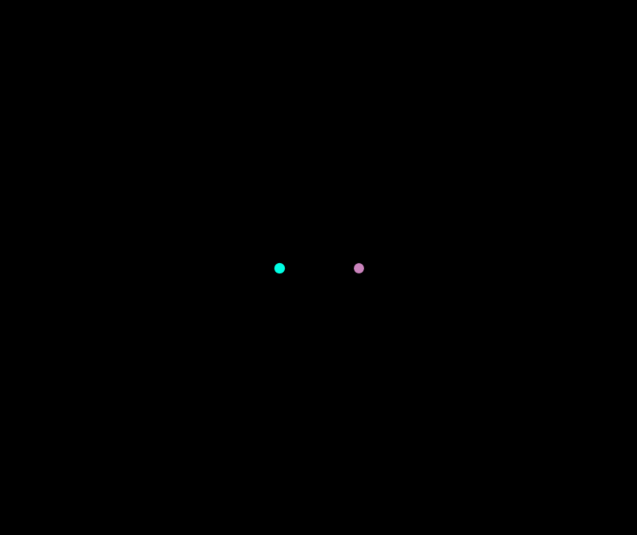
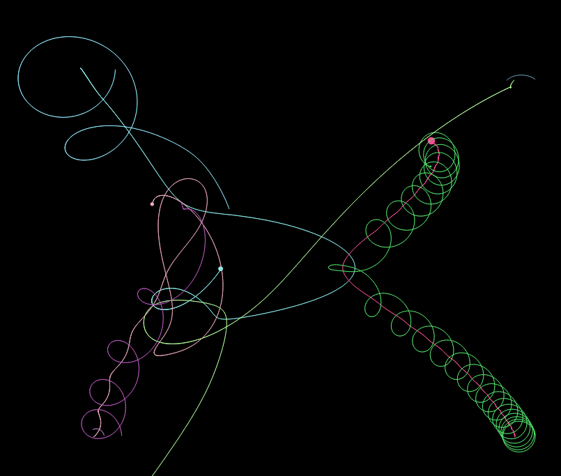

# Gravity-Sim

## Screenshots

2-Body in perfect orbit around a common center of mass.

Here is the full orbit path:

2-Body in orbit around a common center of mass but offset

Here is the full orbit path:

One feature of this simulator is Collision.
Here is a preset system is collision off:

Here is a preset system is collision on:

The difference:

---

Square Layout:

Square Full Path:

